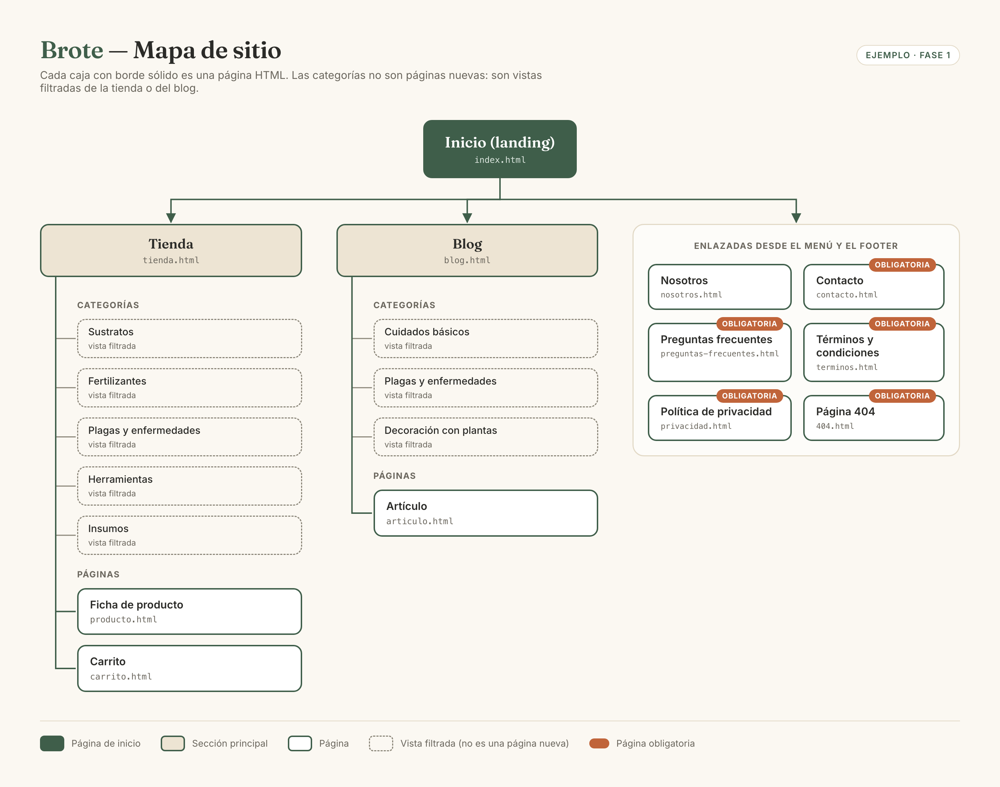
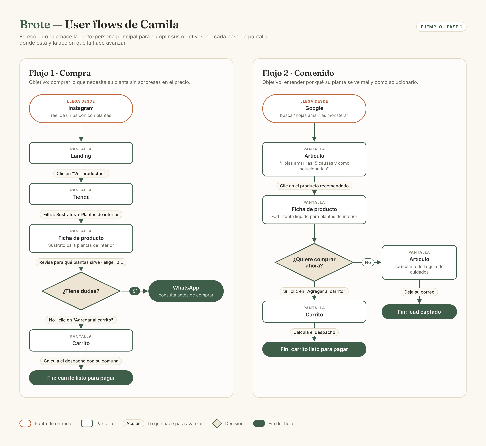

# Arquitectura de la información — Brote

> Guía: [Arquitectura de la información](../evaluacion/guias/fase-1-requerimientos/05-arquitectura.md)

## Mapa de sitio

```text
Inicio (landing)
├── Tienda
│   ├── Categoría: Sustratos
│   ├── Categoría: Fertilizantes
│   ├── Categoría: Plagas y enfermedades
│   ├── Categoría: Herramientas
│   ├── Categoría: Insumos
│   ├── Ficha de producto
│   └── Carrito
├── Blog
│   ├── Categoría: Cuidados básicos
│   ├── Categoría: Plagas y enfermedades
│   ├── Categoría: Decoración con plantas
│   └── Artículo
├── Nosotros
├── Contacto
├── Preguntas frecuentes
├── Términos y condiciones
├── Política de privacidad
└── 404
```

Las categorías no son páginas nuevas: son la misma página de tienda o de blog, filtrada.



### Dónde ocurre cada funcionalidad

| Funcionalidad | Página |
|---|---|
| Captación de correos con la guía de cuidados | Inicio y Artículo |
| Plantas fáciles para empezar | Inicio |
| Buscar y filtrar productos | Tienda |
| Ver detalle, guía de uso, elegir formato y agregar al carrito | Ficha de producto |
| Consultar por WhatsApp | Ficha de producto |
| Diagnóstico por síntoma | Blog (categoría Plagas y enfermedades) |
| Kits por tipo de planta | Tienda |
| Calcular despacho | Carrito |
| Navegar por categorías, comentar y compartir | Blog y Artículo |

## User flows

> Guía: [User flow](../evaluacion/guias/fase-1-requerimientos/06-user-flow.md)

### Flujo 1: compra

```text
Instagram (reel de un balcón con plantas)
→ Landing
→ [Clic en "Ver productos"]
→ Tienda
→ [Filtra por "Sustratos" y "Plantas de interior"]
→ Ficha de producto: Sustrato para plantas de interior
→ [Revisa para qué plantas sirve y elige el formato de 10 L]
◇ ¿Tiene dudas?
   ├── Sí → [Clic en "Consultar por WhatsApp"] → WhatsApp
   └── No → [Clic en "Agregar al carrito"]
→ Carrito
→ [Calcula despacho con su comuna]
→ Fin: carrito listo para pagar
```

### Flujo 2: contenido

```text
Google ("hojas amarillas monstera")
→ Artículo: "Hojas amarillas: 5 causas y cómo solucionarlas"
→ [Lee y hace clic en el producto recomendado]
→ Ficha de producto: Fertilizante líquido para plantas de interior
◇ ¿Quiere comprar ahora?
   ├── Sí → [Agregar al carrito] → Carrito
   └── No → [Vuelve al artículo y deja su correo para recibir la guía de cuidados]
          → Fin: lead captado
```

### Diagrama de los dos flujos



## Categorías

> Guía: [Categorías de productos y temas del blog](../evaluacion/guias/fase-1-requerimientos/07-categorias.md)

### Categorías de productos

| Categoría | Productos |
|---|---|
| Sustratos | Tierra de hoja, sustrato para plantas de interior, sustrato para suculentas, perlita |
| Fertilizantes | Humus de lombriz, fertilizante líquido para plantas de interior, fertilizante para floración |
| Plagas y enfermedades | Aceite de neem, jabón potásico, fungicida de cobre |
| Herramientas | Tijera de podar, pala de mano, regadera, pulverizador |
| Insumos | Maceteros de greda, platos para macetero, guías de plantas impresas, tutores |

La categoría que vende fitosanitarios se llama **Plagas y enfermedades**: a Camila le frustran los nombres técnicos y busca por el problema que tiene, no por el tipo de producto.

Filtros adicionales de la tienda: **tipo de planta** (interior, exterior, suculentas y cactus, huerto) y **precio**.

### Categorías del blog

| Categoría | Idea de artículo | Necesidad o motivación de la proto-persona | Producto relacionado |
|---|---|---|---|
| Cuidados básicos | "Cuánto regar tus plantas de interior (y por qué se te mueren)" | A Camila le frustra que se le mueran las plantas | Sustrato para plantas de interior, regadera |
| Plagas y enfermedades | "Hojas amarillas: 5 causas y cómo solucionarlas" | Camila necesita que la guíen cuando una planta se ve mal | Fertilizante líquido, aceite de neem |
| Decoración con plantas | "5 plantas fáciles para un departamento con poca luz" | Camila quiere una casa bonita con plantas | Maceteros de greda, guías de plantas |
