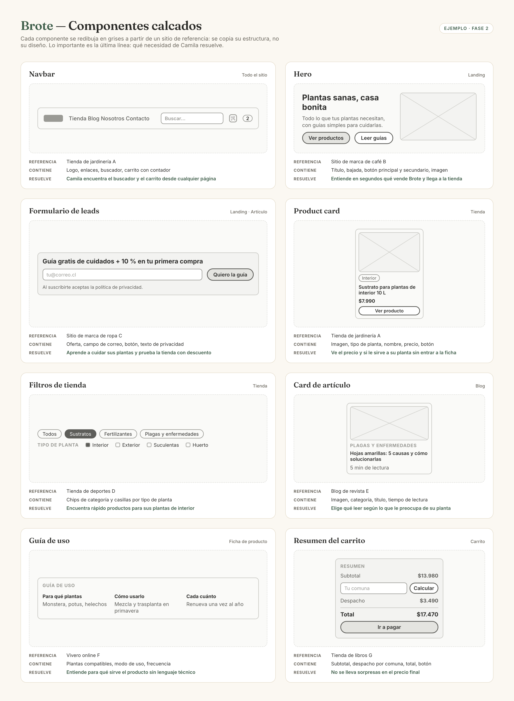

# Componentes — Brote

> Guía: [Componentes](../evaluacion/guias/fase-2-specs/03-calco-de-componentes.md)

**Tablero en Whimsical:** [pendiente: pegar aquí el link público del tablero de componentes]

| Componente | Referencia | Qué contiene | Qué necesidad resuelve |
|---|---|---|---|
| Navbar | Tienda de jardinería A | Logo, enlaces (Tienda, Blog, Nosotros, Contacto), buscador, carrito con contador | Camila encuentra el buscador y el carrito desde cualquier página |
| Hero | Sitio de marca de café B | Título, bajada, botón principal y secundario, imagen | Entiende en segundos qué vende Brote y llega a la tienda |
| Formulario de leads | Sitio de marca de ropa C | Oferta, campo de correo, botón, texto de privacidad | Aprende a cuidar sus plantas y prueba la tienda con descuento |
| Product card | Tienda de jardinería A | Imagen, etiqueta de tipo de planta, nombre, precio, botón "Ver producto" | Ve el precio y si le sirve a su planta sin entrar a la ficha |
| Filtros de tienda | Tienda de deportes D | Chips de categoría y casillas por tipo de planta | Encuentra rápido productos para sus plantas de interior |
| Card de artículo | Blog de revista E | Imagen, categoría, título, tiempo de lectura | Elige qué leer según lo que le preocupa de su planta |
| Guía de uso | Vivero online F | Plantas compatibles, modo de uso, frecuencia | Entiende para qué sirve el producto sin lenguaje técnico |
| Resumen del carrito | Tienda de libros G | Subtotal, despacho por comuna, total, botón | No se lleva sorpresas en el precio final |
