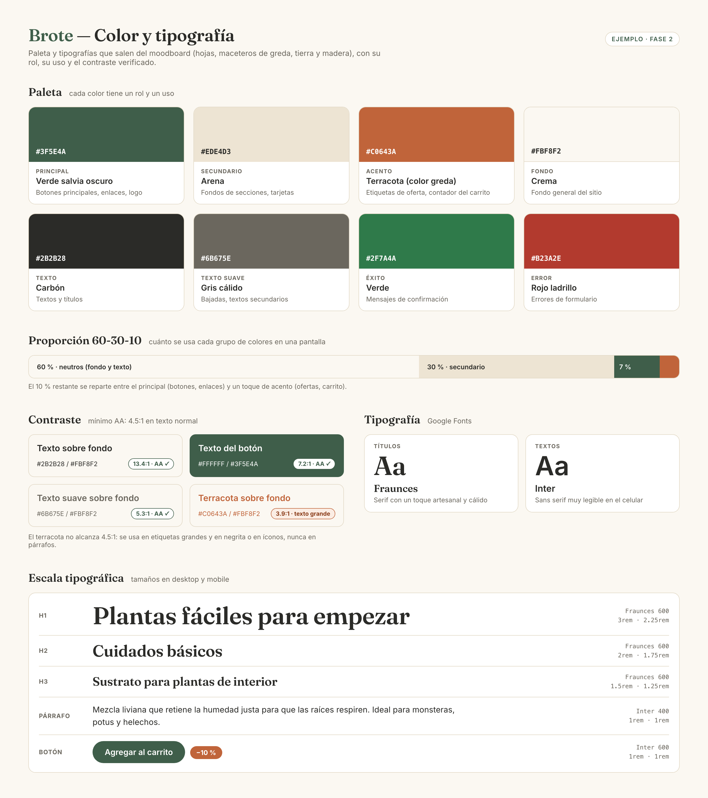

# Color y tipografía — Brote

> Guía: [Color y tipografía](../evaluacion/guias/fase-2-specs/05-color-y-tipografia.md)

## Paleta

| Rol | Color | HEX | Uso |
|---|---|---|---|
| Principal | Verde salvia oscuro | #3F5E4A | Botones principales, enlaces, logo |
| Secundario | Arena | #EDE4D3 | Fondos de secciones, tarjetas |
| Acento | Terracota (color greda) | #C0643A | Contador del carrito, íconos y detalles |
| Acento oscuro | Terracota oscuro | #A9552F | Fondo de etiquetas con texto blanco (ofertas, ahorro) |
| Fondo | Crema | #FBF8F2 | Fondo general |
| Texto | Carbón | #2B2B28 | Textos y títulos |
| Texto suave | Gris cálido | #6B675E | Bajadas, textos secundarios |
| Éxito | Verde | #2F7A4A | Mensajes de confirmación |
| Error | Rojo ladrillo | #B23A2E | Errores de formulario |

Proporción de uso: 60 % neutros (fondo y texto), 30 % secundario, 10 % principal y acento.

## Contraste

Verificado con el [verificador de contraste de WebAIM](https://webaim.org/resources/contrastchecker/).

| Combinación | Ratio | Resultado |
|---|---|---|
| Texto #2B2B28 sobre fondo #FBF8F2 | 13.4:1 | AA ✅ |
| Texto #2B2B28 sobre secundario #EDE4D3 | 11.3:1 | AA ✅ |
| Texto blanco sobre principal #3F5E4A | 7.2:1 | AA ✅ |
| Texto suave #6B675E sobre fondo #FBF8F2 | 5.3:1 | AA ✅ |
| Terracota #C0643A sobre fondo #FBF8F2 | 3.9:1 | Solo íconos y detalles ⚠️ |
| Texto blanco sobre terracota #C0643A | 4.1:1 | No alcanza AA ❌ |
| Texto blanco sobre terracota oscuro #A9552F | 5.2:1 | AA ✅ |

El terracota no alcanza 4.5:1 ni como texto ni como fondo de texto blanco (lo detectó el linter de `DESIGN.md`). Por eso se agregó el terracota oscuro para las etiquetas con texto, y el terracota original queda para íconos y detalles.

## Tipografía

- **Títulos:** Fraunces (serif con un toque artesanal y cálido).
- **Textos:** Inter (sans serif muy legible en pantallas pequeñas).

| Elemento | Desktop | Mobile | Peso |
|---|---|---|---|
| h1 | 3rem | 2.25rem | 600 |
| h2 | 2rem | 1.75rem | 600 |
| h3 | 1.5rem | 1.25rem | 600 |
| Párrafo | 1rem | 1rem | 400 |
| Botón | 1rem | 1rem | 600 |

## Justificación

El verde salvia viene de las hojas del moodboard, el terracota de los maceteros de greda y el arena de la tierra y la madera: juntos transmiten lo natural y vivo. El fondo crema evita el blanco frío. Fraunces le da calidez a los títulos, e Inter asegura que Camila pueda leer las guías de cuidado y de uso sin esfuerzo en su celular.
