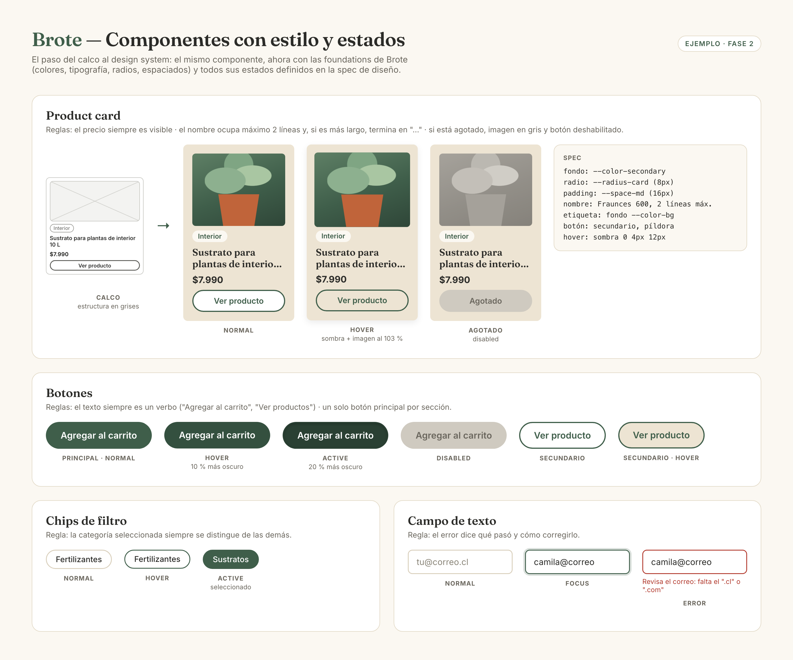

# Spec de diseño — Brote

> Guía: [Spec de diseño](../evaluacion/guias/fase-2-specs/06-spec-de-diseno.md)

La spec de diseño tiene dos partes:

1. **[`DESIGN.md`](../DESIGN.md)** (en la raíz del repositorio): el design system de Brote en el formato que Stitch importa. Define colores, tipografía, espaciados, formas, componentes con sus estados y reglas. Validado con `npx @google/design.md lint DESIGN.md`: 0 errores, 0 advertencias.
2. **Este documento:** las pantallas, escritas como prompts listos para pegar en Stitch.

**Wireframes en Whimsical:** [pendiente: pegar aquí el link público del tablero de wireframes]




## Cómo usarlo en Stitch

1. Crea un proyecto web en [Stitch](https://stitch.withgoogle.com) e importa `DESIGN.md` como design system del proyecto.
2. Genera las pantallas en este orden, **una por prompt**: landing, tienda, ficha de producto, carrito, blog y artículo. Si Stitch permite adjuntar imágenes, sube también el wireframe de esa pantalla.
3. Cuando estén las 6 en desktop, pide la versión mobile de cada una con el prompt del final.
4. Compara cada pantalla con estas specs y anota las correcciones en `11-qa.md`.

## Pantallas

### 1. Landing

```text
Pantalla: Landing de Brote (index), versión desktop. Usa el design system del proyecto.
Objetivo: que Camila entienda qué es Brote, vaya a la tienda y deje su correo.
Componentes, de arriba hacia abajo:
1. Navbar.
2. Hero: a la izquierda, h1 "Plantas sanas, casa bonita", bajada "Todo lo que
   tus plantas necesitan, con guías simples para cuidarlas.", button-primary
   "Ver productos" y button-secondary "Leer guías"; a la derecha, foto de un
   balcón de departamento con plantas y luz natural.
3. Sección "Plantas fáciles para empezar": 3 cards (Potus, Monstera,
   Suculentas) con foto, nombre y enlace "Ver lo que necesita".
4. box-lead-form: "Guía gratis de cuidados + 10 % en tu primera compra",
   campo de correo, botón "Quiero la guía", texto de privacidad.
5. Sección "Del blog": 3 card-article.
6. Footer.
```

### 2. Tienda

```text
Pantalla: Tienda de Brote, versión desktop. Usa el design system del proyecto.
Objetivo: que Camila encuentre rápido lo que necesita su planta.
Componentes, de arriba hacia abajo:
1. Navbar.
2. h1 "Tienda" y buscador con el texto "Buscar productos o plantas…".
3. Chips de categoría: Todos, Sustratos (activo), Fertilizantes, Plagas y
   enfermedades, Herramientas, Insumos.
4. Fila de 3 card-kit: Kit plantas de interior (ahorra $2.500), Kit
   suculentas (ahorra $1.900), Kit huerto (ahorra $3.200).
5. A la izquierda, columna de filtros de 240px: "Tipo de planta" (Interior
   marcado, Exterior, Suculentas y cactus, Huerto) y rango de precio.
   A la derecha, grilla de 3 columnas con 6 card-product:
   Sustrato para plantas de interior 10 L $7.990 (Interior),
   Tierra de hoja 20 L $5.490 (Interior), Sustrato para suculentas 5 L
   $6.490 (Suculentas), Perlita 5 L $4.990, Humus de lombriz 5 L $6.990,
   Sustrato para huerto 20 L $8.490 (Huerto).
6. Footer.
```

### 3. Ficha de producto

```text
Pantalla: Ficha de producto de Brote, versión desktop. Usa el design system del proyecto.
Objetivo: que Camila entienda para qué sirve el producto y lo agregue al carrito.
Componentes, de arriba hacia abajo:
1. Navbar.
2. Ruta de navegación: Tienda › Sustratos › Sustrato para plantas de interior.
3. A la izquierda, foto grande del sustrato en un macetero de greda. A la
   derecha: tag-plant "Interior", h1 "Sustrato para plantas de interior",
   precio $7.990, selector de formato con chips 5 L, 10 L (activo) y 20 L,
   button-primary "Agregar al carrito" y button-secondary "Consultar por WhatsApp".
4. box-usage-guide con tres columnas e íconos: "Para qué plantas: monstera,
   potus, helechos", "Cómo usarlo: mezcla y trasplanta en primavera",
   "Cada cuánto: renueva una vez al año".
5. "Productos relacionados": 3 card-product.
6. Footer.
```

### 4. Carrito

```text
Pantalla: Carrito de Brote, versión desktop. Usa el design system del proyecto.
Objetivo: que Camila vea el costo total, con despacho, antes de pagar.
Componentes, de arriba hacia abajo:
1. Navbar con el contador del carrito en 2.
2. h1 "Tu carrito".
3. A la izquierda, lista de productos (foto, nombre, formato, selector de
   cantidad y precio): Sustrato para plantas de interior 10 L $7.990 y
   Fertilizante líquido para plantas de interior 500 ml $5.990. Debajo,
   enlace "Seguir comprando".
   A la derecha, box-cart-summary: subtotal $13.980, campo "Tu comuna" con
   botón "Calcular", despacho $3.490, total $17.470 y button-primary "Ir a pagar".
4. Footer.
```

### 5. Blog

```text
Pantalla: Blog de Brote, versión desktop. Usa el design system del proyecto.
Objetivo: que Camila encuentre consejos sobre lo que le preocupa de su planta.
Componentes, de arriba hacia abajo:
1. Navbar.
2. h1 "Blog".
3. Caja "¿Qué le pasa a tu planta?" con tres button-secondary con ícono:
   Hojas amarillas, Manchas en las hojas, Plagas.
4. Chips de categoría: Todos (activo), Cuidados básicos, Plagas y
   enfermedades, Decoración con plantas.
5. Grilla de 3 columnas con card-article: "Hojas amarillas: 5 causas y cómo
   solucionarlas" (Plagas y enfermedades, 5 min), "Cuánto regar tus plantas
   de interior" (Cuidados básicos, 4 min), "5 plantas fáciles para un
   departamento con poca luz" (Decoración con plantas, 3 min),
   "Cuándo trasplantar una planta" (Cuidados básicos, 4 min).
6. Footer.
```

### 6. Artículo

```text
Pantalla: Artículo del blog de Brote, versión desktop. Usa el design system del proyecto.
Objetivo: que Camila resuelva su problema y llegue al producto que lo soluciona.
Componentes, de arriba hacia abajo, en una columna de texto de máximo 720px:
1. Navbar.
2. Categoría "Plagas y enfermedades · 5 min de lectura", h1 "Hojas
   amarillas: 5 causas y cómo solucionarlas" y foto de una monstera con
   hojas amarillas.
3. Texto del artículo con subtítulos h2 para cada causa.
4. Producto recomendado: card-product horizontal "Fertilizante líquido
   para plantas de interior" con botón "Ver producto".
5. Compartir: chips WhatsApp, Instagram y Copiar link.
6. Comentarios: 2 comentarios de ejemplo y un input-field "Escribe tu duda"
   con botón "Comentar".
7. box-lead-form: "¿Te sirvió? Recibe la guía de cuidados gratis".
8. Footer.
```

### Versión mobile (para cada pantalla)

```text
Genera la versión mobile (375px de ancho) de esta pantalla siguiendo la
sección Layout del design system: navbar con logo, carrito y menú
hamburguesa; una columna; imágenes arriba del texto; los filtros de la
tienda se abren desde un botón "Filtrar"; el resumen del carrito va
debajo de la lista. Sin scroll horizontal.
```
