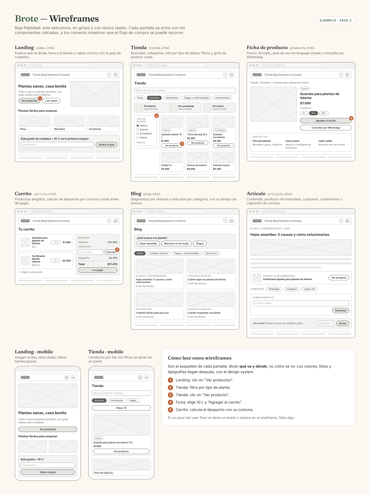

# Wireframes

**Archivo:** link en `docs/09-spec-diseno.md` + tablero en Whimsical · **Fase 2** · **4 pts**

## Qué es y para qué sirve

Un **wireframe** es el esqueleto de una página: muestra **qué va y dónde va**, sin colores, fotos ni tipografías definitivas. Es un prototipo de **baja fidelidad**.

Sirve para decidir la estructura antes de preocuparte por cómo se ve. Es mucho más rápido mover una caja gris que rehacer una página diseñada.

> Primero organizamos. Después diseñamos.

## Qué entregas

- Wireframes en **Whimsical** de las 6 pantallas: **landing, blog, artículo, tienda, ficha de producto y carrito**.
- El link del tablero (abierto) en tu spec de diseño.

## Paso a paso

### 1. Parte por el mapa de sitio y el user flow

Cada pantalla de tu mapa de sitio necesita un wireframe. Tu user flow te dice qué botones y enlaces necesita cada una para que la persona pueda avanzar.

### 2. Arma cada pantalla con tus componentes

Usa los componentes que calcaste en el paso anterior. Duplica el componente y ubícalo en la pantalla. Esa es la gracia de los componentes: los diseñas una vez y los reutilizas.

### 3. Ordena por importancia

Lo más importante para tu proto-persona va arriba y más grande. Pregúntate en cada pantalla: **¿qué es lo primero que tiene que ver?**

### 4. Usa contenido real (o casi)

En vez de "Lorem ipsum", escribe los títulos y textos reales: "Sustrato para plantas de interior 10 L", "$7.990". Así descubres si el espacio alcanza y si el mensaje se entiende.

### 5. Conecta las pantallas

En Whimsical puedes unir con flechas los botones con la pantalla a la que llevan. Recorre tu user flow sobre los wireframes: si en algún paso no hay un botón para avanzar, falta algo.

### 6. Revisa que estén todas tus funcionalidades

Abre tu tabla de funcionalidades y, para cada una **imprescindible y deseable**, busca en qué wireframe ocurre. Si una funcionalidad no aparece en ninguna pantalla, falta un componente o una sección. Por ejemplo, en Brote los kits por tipo de planta necesitan una fila en la tienda, y el diagnóstico por síntoma, un bloque en el blog.

Las funcionalidades de prioridad **futuro** no necesitan aparecer.

### 7. (Recomendado) Haz también la versión mobile

Tu proto-persona probablemente compra desde el celular. Haz la versión mobile al menos de la landing y la tienda: te va a ayudar a definir el comportamiento responsive en la spec.

## Ejemplo

Wireframe de la tienda de Brote, en texto:

```text
┌──────────────────────────────────────────────┐
│ [NAVBAR] Logo · Tienda · Blog · 🔍 · 🛒(2)   │
├──────────────────────────────────────────────┤
│ Tienda                                        │
│ [Buscar productos o plantas...]               │
│ (Todos) (Sustratos) (Fertilizantes) (Más ▾)   │
├───────────┬──────────────────────────────────┤
│ FILTROS   │ [CARD]     [CARD]     [CARD]     │
│ Planta    │ imagen     imagen     imagen     │
│ □ Interior│ Nombre     Nombre     Nombre     │
│ □ Exterior│ $7.990     $5.490     $9.990     │
│ □ Huerto  │ [Ver]      [Ver]      [Ver]      │
│ Precio    │                                  │
│ ───●───── │ [CARD]     [CARD]     [CARD]     │
├───────────┴──────────────────────────────────┤
│ [FOOTER]                                      │
└──────────────────────────────────────────────┘
```

Y las 6 pantallas de Brote, más la versión mobile de la landing y la tienda. Los números marcan los pasos del flujo de compra: si un paso no tiene botón o enlace, falta algo.



## Errores comunes

- **Diseñar con colores y fotos**: en esta etapa, solo grises y cajas.
- **Pantallas que no siguen el user flow**: botones que no llevan a ninguna parte o pasos sin botón.
- **Inventar componentes nuevos en cada pantalla** en vez de reutilizar los calcados.
- **Faltan pantallas**: son 6.
- **Funcionalidades sin lugar**: están en la tabla de funcionalidades, pero no aparecen en ninguna pantalla.

## Checklist

- [ ] Wireframes de landing, blog, artículo, tienda, ficha de producto y carrito
- [ ] Construidos con los componentes calcados
- [ ] Los botones y enlaces permiten recorrer el user flow
- [ ] Cada funcionalidad imprescindible y deseable aparece en algún wireframe
- [ ] Textos reales o cercanos a los reales
- [ ] Link del tablero abierto, pegado en la spec de diseño
