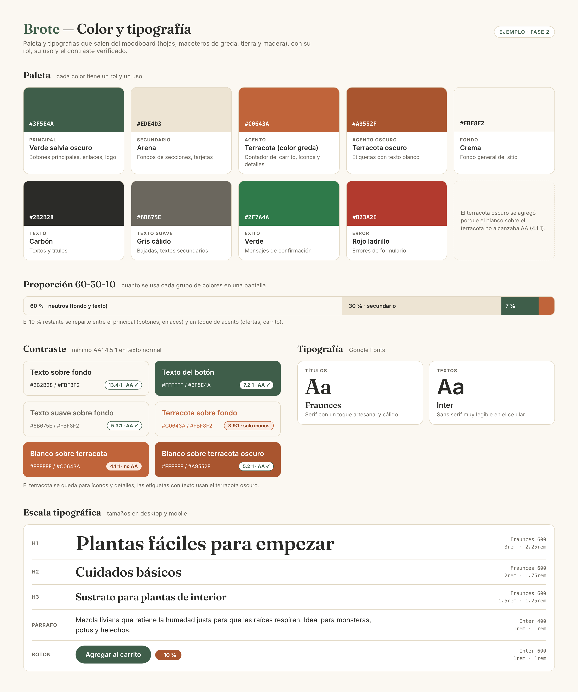

# Paleta de color y tipografía

**Archivo:** `docs/08-color-tipografia.md` · **Fase 2** · **5 pts**

## Qué es y para qué sirve

La **paleta de color** y la **tipografía** son las primeras decisiones de la identidad visual de tu sitio. Salen de tu moodboard: si ahí definiste que la marca es *natural y cálida*, los colores y las letras tienen que transmitir eso.

Estas decisiones se vuelven reglas: en la spec de diseño se transforman en las **foundations** de tu design system, y en el código, en **variables de CSS**.

## Qué entregas

- **Paleta**: color principal, secundario, de acento, neutros (fondo y texto) y colores de estado (éxito y error). Cada uno con su código **HEX** y su **uso**.
- **Contraste** verificado.
- **Tipografía**: una para títulos y otra para textos, de Google Fonts, con su **escala de tamaños**.
- **Justificación** desde el moodboard.

## Paso a paso

### 1. Extrae colores del moodboard

Mira tu moodboard y elige los colores que más se repiten o que mejor representan tus palabras clave. Herramientas que ayudan: el cuentagotas de Whimsical o de tu navegador, [Coolors](https://coolors.co) o [Adobe Color](https://color.adobe.com) (tienen la opción de extraer colores de una imagen).

### 2. Asigna un rol a cada color

| Rol | Para qué se usa |
|---|---|
| **Principal** | El color de la marca: botones principales, enlaces, elementos destacados |
| **Secundario** | Acompaña al principal: fondos de secciones, detalles |
| **Acento** | Poco y para llamar la atención: ofertas, etiquetas, notificaciones |
| **Neutros** | Fondo, texto, bordes. Son los que más se usan |
| **Estados** | Éxito (verde) y error (rojo) para mensajes y formularios |

Una guía simple de proporción es la **regla 60-30-10**: 60 % neutros, 30 % secundario, 10 % principal y acento.

### 3. Verifica el contraste

El texto tiene que leerse bien sobre su fondo. Usa el [verificador de contraste de WebAIM](https://webaim.org/resources/contrastchecker/) y revisa que las combinaciones de texto cumplan al menos **AA** (4.5:1 para texto normal).

Revisa por lo menos: texto sobre fondo, texto del botón sobre el color principal, y enlaces sobre fondo.

### 4. Elige dos tipografías

En [Google Fonts](https://fonts.google.com):

- Una para **títulos**: puede tener más personalidad.
- Una para **textos**: tiene que ser muy legible en tamaños pequeños y en el celular.

Si no sabes cómo combinarlas, una opción segura es una serif para títulos y una sans serif para textos (o al revés).

### 5. Define la escala de tamaños

| Elemento | Tamaño (desktop) | Tamaño (mobile) | Peso |
|---|---|---|---|
| h1 | | | |
| h2 | | | |
| h3 | | | |
| Párrafo | | | |
| Botón | | | |

Usa `rem` (1rem = 16px).

### 6. Justifica

¿Por qué estos colores y estas tipografías? Conéctalos con tu moodboard y tu proto-persona.

## Ejemplo

```markdown
# Color y tipografía — Brote

## Paleta

| Rol | Color | HEX | Uso |
|---|---|---|---|
| Principal | Verde salvia oscuro | #3F5E4A | Botones principales, enlaces, logo |
| Secundario | Arena | #EDE4D3 | Fondos de secciones, tarjetas |
| Acento | Terracota (color greda) | #C0643A | Contador del carrito, íconos y detalles |
| Acento oscuro | Terracota oscuro | #A9552F | Fondo de etiquetas con texto blanco (ofertas, ahorro) |
| Fondo | Crema | #FBF8F2 | Fondo general |
| Texto | Carbón | #2B2B28 | Textos y títulos |
| Texto suave | Gris cálido | #6B675E | Bajadas, textos secundarios |
| Éxito | Verde | #2F7A4A | Mensajes de confirmación |
| Error | Rojo ladrillo | #B23A2E | Errores de formulario |

## Contraste

| Combinación | Ratio | Resultado |
|---|---|---|
| Texto #2B2B28 sobre fondo #FBF8F2 | 13.4:1 | AA ✅ |
| Texto blanco sobre principal #3F5E4A | 7.2:1 | AA ✅ |
| Texto suave #6B675E sobre fondo #FBF8F2 | 5.3:1 | AA ✅ |
| Terracota #C0643A sobre fondo #FBF8F2 | 3.9:1 | Solo íconos y detalles ⚠️ |
| Texto blanco sobre terracota #C0643A | 4.1:1 | No alcanza AA ❌ |
| Texto blanco sobre terracota oscuro #A9552F | 5.2:1 | AA ✅ |

## Tipografía

- **Títulos:** Fraunces (serif con un toque artesanal).
- **Textos:** Inter (sans serif muy legible en pantallas pequeñas).

| Elemento | Desktop | Mobile | Peso |
|---|---|---|---|
| h1 | 3rem | 2.25rem | 600 |
| h2 | 2rem | 1.75rem | 600 |
| h3 | 1.5rem | 1.25rem | 600 |
| Párrafo | 1rem | 1rem | 400 |
| Botón | 1rem | 1rem | 600 |

## Justificación

El verde salvia viene de las hojas del moodboard, el terracota de los
maceteros de greda y el arena de la tierra y la madera: juntos transmiten lo
natural y vivo. El fondo crema evita el blanco frío. Fraunces le da calidez a
los títulos, e Inter asegura que Camila pueda leer las guías de cuidado y de
uso sin esfuerzo en su celular.
```

Fíjate en las tres últimas filas: el terracota no alcanza 4.5:1 ni como texto ni como fondo de un texto blanco. Por eso Brote suma un **terracota oscuro** para las etiquetas con texto, y deja el terracota original para íconos y detalles. Verificar el contraste no es solo aprobar o reprobar un color: te dice **dónde** puedes usarlo, y a veces te obliga a agregar una variante.

En la spec de diseño vas a pasar esta paleta a tu `DESIGN.md`, y su validador vuelve a revisar el contraste de cada componente.

Así se ve el ejemplo como lámina, que puedes armar en Whimsical, Canva o Figma para presentar tu paleta:



## Cómo usar la IA

```text
Este es mi moodboard: [describe o adjunta la captura].
Mis palabras clave son: [palabras]. Propón una paleta con color
principal, secundario, acento, fondo, texto, éxito y error (con HEX),
y dos tipografías de Google Fonts para títulos y textos.
Explica por qué cada elección calza con mis palabras clave.
```

Después **verifica tú el contraste** con la herramienta: la IA a veces se equivoca en los cálculos.

## Errores comunes

- **Colores sin rol**: una lista de HEX no dice cuándo usar cada uno.
- **No verificar el contraste**, sobre todo texto blanco sobre colores claros.
- **Tres o más tipografías**: con dos es suficiente.
- **Tipografía de títulos para los textos**: las decorativas son ilegibles en párrafos.

## Checklist

- [ ] Colores principal, secundario, acento, neutros y estados, con HEX y uso
- [ ] Contraste verificado (mínimo AA)
- [ ] Tipografía de títulos y de textos, de Google Fonts
- [ ] Escala de tamaños para h1, h2, h3, párrafo y botón
- [ ] Justificación desde el moodboard
